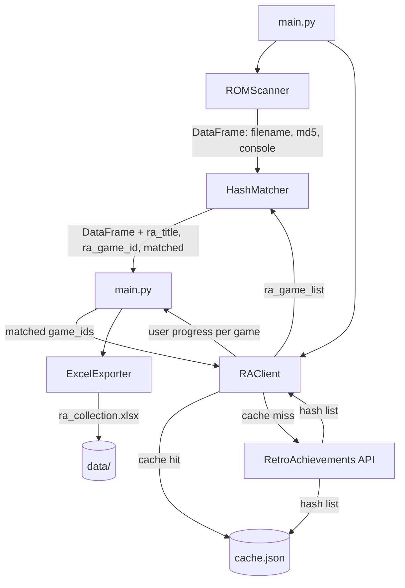

# Architecture

## Overview

ra-rom-manager is a local Python tool that scans a ROM library, verifies files against the RetroAchievements hash database, and tracks achievement progress per game. It is designed to run on demand from the command line and produce a structured Excel report.

The architecture follows a strict layered model: each module has one responsibility and dependencies only flow downward. `main.py` orchestrates; it never contains logic.

---

## Module Responsibilities

| Module | Responsibility |
|--------|---------------|
| `main.py` | Entry point. Orchestrates the pipeline in order. No business logic. |
| `scanner.py` | Walks the ROM directory, computes MD5 hashes, returns a DataFrame. |
| `matcher.py` | Builds a hash → game lookup from RA data. Matches scanner output against it. |
| `api_client.py` | All communication with the RetroAchievements API. Cache-aware. Raises `RAClientError` on failure. |
| `cache.py` | TTL-based local JSON cache. Sits between `api_client` and the network. |
| `config.py` | Console ID map, folder name map, ROM path resolution from `.env`. |
| `exporter.py` | Takes the final DataFrame and writes the Excel workbook. *(M4)* |
| `stats.py` | Enriches the DataFrame with completion labels and statistics. *(M3/M4)* |

---

## Data Flow



---

## Pipeline Execution Order

1. **Scan** — `ROMScanner.scan()` walks `ROM_PATH`, hashes every supported file, returns a DataFrame with `filename`, `md5`, `extension`, `path`, `console`.

2. **Fetch & Match** — For each detected console folder, `RAClient.get_console_game_hashes()` returns the RA hash list (from cache or API). `HashMatcher.match()` adds `ra_title`, `ra_game_id`, and `matched` columns to the DataFrame.

3. **Progress Fetch** *(M3)* — For each matched game, `RAClient.get_user_progress()` retrieves achievement counts. Adds `earned`, `total`, `completion_pct`, `is_mastered` columns.

4. **Export** *(M4)* — `ExcelExporter` writes `data/ra_collection.xlsx` with per-console sheets, a summary sheet, and a want-to-play sheet.

---

## Caching Strategy

All API responses are cached locally in `data/cache.json`.

| Cache key pattern | Content | TTL |
|-------------------|---------|-----|
| `console_{id}` | Full game + hash list for a console | 24 hours |
| `progress_{game_id}` | User achievement progress for a game | 1 hour |
| `summary_{username}` | User profile stats (points, rank) | 1 hour |

Cache is bypassed by passing `force_refresh=True` to any `RAClient` method, or cleared entirely with `cache.clear_all()`.

---

## Console Detection

The scanner infers the console from the ROM subfolder name. The mapping lives in `config.py`:

```
ROM_PATH/
├── gba/      →  Console ID 4   (Game Boy Advance)
├── gb/       →  Console ID 5   (Game Boy)
├── gbc/      →  Console ID 6   (Game Boy Color)
├── snes/     →  Console ID 3   (Super Nintendo)
├── nes/      →  Console ID 7   (NES)
├── psx/      →  Console ID 11  (PlayStation)
└── ...
```

Unknown folder names are logged as warnings and skipped — they do not crash the run.

---

## Error Handling

- `RAClientError` is raised for all network-level failures (timeout, HTTP error, connection refused). Callers in `main.py` catch this and skip the affected console with a warning.
- `OSError` is raised by `get_rom_path()` if `ROM_PATH` is missing or does not exist on disk.
- Scanner errors on individual files are caught per-file and logged — one bad file does not abort the scan.

---

## Directory Structure

```
ra-rom-manager/
├── .devcontainer/
│   └── devcontainer.json
├── .github/
│   └── workflows/
│       └── ci.yml
├── data/                        # gitignored — runtime outputs
│   ├── cache.json
│   └── ra_collection.xlsx
├── docs/
│   └── ARCHITECTURE.md          # this file
├── src/
│   └── ra_manager/
│       ├── __init__.py
│       ├── api_client.py
│       ├── cache.py
│       ├── config.py
│       ├── exporter.py          # M4
│       ├── matcher.py
│       ├── scanner.py
│       └── stats.py             # M3/M4
├── tests/
│   └── fixtures/
│       └── mock_ra_data.json
├── main.py
├── pyproject.toml
└── issues.json
```

---

## Future: Want-to-Play List

`data/want_to_play.csv` is a manually maintained file with columns `ra_game_id`, `title`, `console`, `notes`, `added_date`. The exporter reads it and merges with RA game data to show achievement totals. Games present in both the local ROM library and the want-to-play list are flagged as `owned`. See issue `[OUTPUT] Add want-to-play list management`.