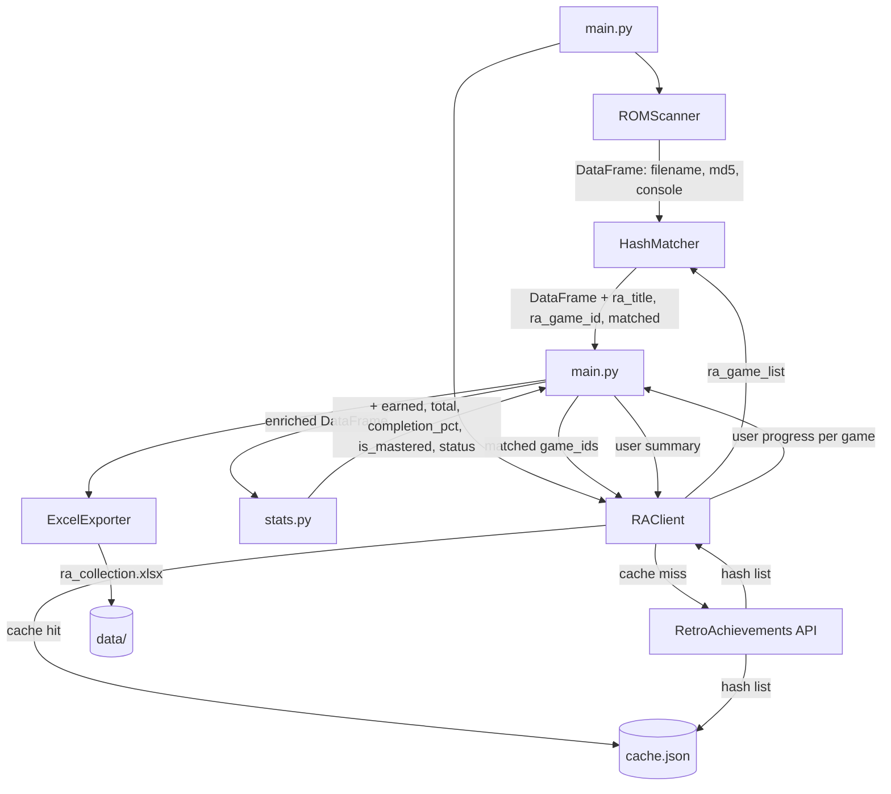

# Architecture

> **Author:** lipofefeyt
> **Last updated:** 2026-03
> **Status:** Current — reflects M1–M4 implementation, M5 design

---

## Overview

ra-rom-manager is a local Python tool that scans a ROM library, verifies files against the RetroAchievements hash database, tracks achievement progress per game, and exports everything to a structured Excel workbook.

The architecture follows a strict layered model: each module has one responsibility and dependencies only flow downward. `main.py` orchestrates; it never contains business logic.

---

## Module Responsibilities

| Module | Responsibility | Status |
|--------|---------------|--------|
| `main.py` | Entry point. Orchestrates the pipeline in order. No business logic. | ✅ M1 |
| `scanner.py` | Walks the ROM directory, computes MD5 hashes, returns a DataFrame. | ✅ M2 |
| `matcher.py` | Builds a hash → game lookup from RA data. Matches scanner output against it. Suggests correct dumps for unmatched ROMs. | ✅ M1 / 🔜 M5 |
| `api_client.py` | All communication with the RetroAchievements API. Cache-aware. Raises `RAClientError` on failure. | ✅ M3 |
| `cache.py` | TTL-based local JSON cache. Sits between `api_client` and the network. | ✅ M2 |
| `config.py` | Console ID map, folder name map, ROM path resolution from `.env`. | ✅ M1 |
| `stats.py` | Enriches the DataFrame with completion labels and achievement progress. | ✅ M3 |
| `exporter.py` | Takes the final DataFrame and writes the Excel workbook. | ✅ M4 |

---

## Data Flow



---

## Pipeline Execution Order

1. **Scan** — `ROMScanner.scan()` walks `ROM_PATH`, hashes every supported file, returns a DataFrame with `filename`, `md5`, `extension`, `path`, `console`, `skipped`, `skip_reason`.

2. **Fetch & Match** — For each detected console folder, `RAClient.get_console_game_hashes()` returns the RA hash list (from cache or API). `HashMatcher.match()` adds `ra_title`, `ra_game_id`, and `matched` columns.

3. **Progress Fetch** — For each matched game, `RAClient.get_user_progress()` retrieves achievement counts. `enrich_with_progress()` adds `earned`, `total`, `completion_pct`, `is_mastered`, `status` columns.

4. **User Summary** — `RAClient.get_user_summary()` fetches overall profile stats (points, rank) for the Summary sheet.

5. **Export** — `ExcelExporter.export()` writes `data/ra_collection.xlsx` with per-console sheets, a Summary sheet, and a Want to Play sheet.

6. *(M5)* **ROM Sourcing Hints** — For each unmatched ROM, `RAClient.get_game_hashes()` retrieves accepted dump filenames. `HashMatcher` adds `suggested_title`, `suggested_filename`, `suggested_md5`, `patch_url` columns. A dedicated Unmatched ROMs sheet surfaces this in the workbook.

---

## Caching Strategy

All API responses are cached locally in `data/cache.json`.

| Cache key pattern | Content | TTL |
|-------------------|---------|-----|
| `console_{id}` | Full game + hash list for a console | 24 hours |
| `progress_{game_id}` | User achievement progress for a game | 1 hour |
| `summary_{username}` | User profile stats (points, rank) | 1 hour |

Cache is bypassed by passing `force_refresh=True` to any `RAClient` method, or cleared entirely with `cache.clear_all()`.

---

## Console Detection

The scanner infers the console from the ROM subfolder name. The mapping lives in `config.py`:

```
ROM_PATH/
├── gba/         →  Console ID 4   (Game Boy Advance)
├── gb/          →  Console ID 5   (Game Boy)
├── gbc/         →  Console ID 6   (Game Boy Color)
├── snes/        →  Console ID 3   (Super Nintendo)
├── nes/         →  Console ID 7   (NES)
├── psx/ ps1/    →  Console ID 11  (PlayStation)
├── ps2/         →  Console ID 12  (PlayStation 2)
├── n64/         →  Console ID 2   (Nintendo 64)
├── nds/         →  Console ID 18  (Nintendo DS)
├── md/ genesis/ →  Console ID 23  (Mega Drive)
├── sms/         →  Console ID 24  (Master System)
├── saturn/      →  Console ID 39  (Saturn)
└── neogeo/      →  Console ID 56  (NeoGeo)
```

Unknown folder names are logged as warnings and skipped — they do not crash the run.

---

## Excel Workbook Structure

| Sheet | Content | Position |
|-------|---------|----------|
| Summary | User RA profile stats + collection overview + per-console breakdown | Always first |
| `<CONSOLE>` | All ROMs for that console with progress and status | One per console, alphabetical |
| Unmatched ROMs *(M5)* | Unmatched ROMs with suggested correct dump filenames | Second to last |
| Want to Play | Sourced from `data/want_to_play.csv` | Always last |

---

## Error Handling

- `RAClientError` is raised for all network-level failures (timeout, HTTP error, connection refused). Callers in `main.py` catch this and skip the affected console with a warning.
- `OSError` is raised by `get_rom_path()` if `ROM_PATH` is missing or does not exist on disk.
- Scanner errors on individual files are caught per-file and logged — one bad file does not abort the scan.
- Progress fetch errors are caught per-game — one failed API call sets `status = "Error"` for that game only.

---

## Directory Structure

```
ra-rom-manager/
├── .devcontainer/
│   └── devcontainer.json
├── .github/
│   └── workflows/
│       └── ci.yml
├── data/                        # gitignored — runtime outputs
│   ├── cache.json
│   ├── ra_collection.xlsx
│   └── want_to_play.csv
├── docs/
│   └── ARCHITECTURE.md          # this file
├── src/
│   └── ra_manager/
│       ├── __init__.py
│       ├── api_client.py
│       ├── cache.py
│       ├── config.py
│       ├── exporter.py
│       ├── matcher.py
│       ├── scanner.py
│       └── stats.py
├── tests/
│   ├── fixtures/
│   │   └── mock_ra_data.json
│   ├── test_api_client.py
│   ├── test_cache.py
│   ├── test_exporter.py
│   ├── test_matcher.py
│   └── test_stats.py
├── main.py
├── pyproject.toml
├── REQUIREMENTS.md
└── issues.json
```

---

## M5 Design — ROM Sourcing Hints

The goal of M5 is to tell the user exactly which file to source for each unmatched ROM.

**New API method:** `RAClient.get_game_hashes(game_id)` calls `API_GetGameHashes.php` and returns:
```json
[
  {
    "MD5": "1bc674be034e43c96b86487ac69d9293",
    "Name": "Sonic The Hedgehog (USA, Europe).md",
    "Labels": ["nointro"],
    "PatchUrl": null
  }
]
```

**Matching strategy:** For each unmatched ROM, a fuzzy title match (using `difflib.get_close_matches`) against the RA game list identifies the most likely intended game. `get_game_hashes()` is then called for that game to retrieve the accepted filenames.

**New DataFrame columns:** `suggested_title`, `suggested_filename`, `suggested_md5`, `patch_url`.

**New Excel sheet:** `Unmatched ROMs` — lists every unmatched ROM alongside the suggested correct dump, enabling the user to know exactly which file to source to get achievements working.