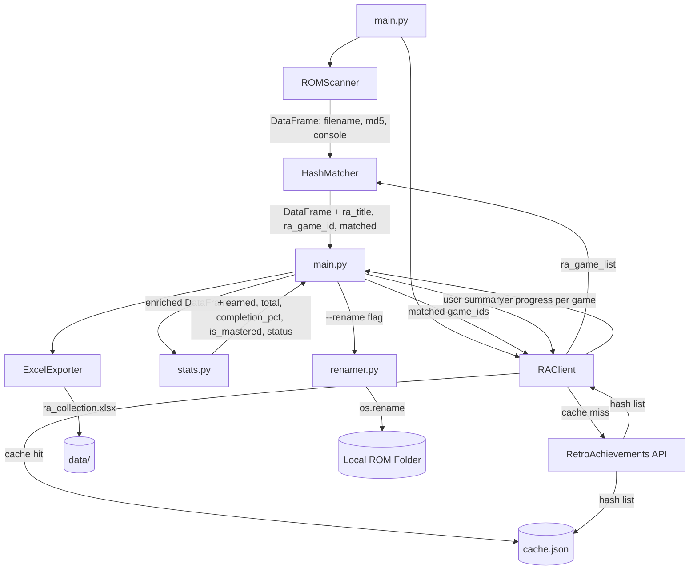

# Architecture

> **Author:** lipofefeyt
> **Last updated:** 2026-04
> **Status:** Current — reflects M1–M5.5 implementation

---

## Overview

ra-rom-manager is a local Python tool that scans a ROM library, verifies files against the RetroAchievements hash database, tracks achievement progress per game, exports everything to a structured Excel workbook, and optionally auto-renames validated files.

The architecture follows a strict layered model: each module has one responsibility and dependencies only flow downward. `main.py` orchestrates; it never contains business logic.

---

## Module Responsibilities

| Module | Responsibility | Status |
|--------|---------------|--------|
| `main.py` | Entry point. Orchestrates the pipeline in order. Handles CLI flags. No business logic. | ✅ M1 |
| `scanner.py` | Walks the ROM directory, computes MD5 hashes, returns a DataFrame. | ✅ M2 |
| `matcher.py` | Builds a hash → game lookup from RA data. Matches scanner output. Deep normalizes strings to suggest dumps for unmatched ROMs. | ✅ M5 |
| `api_client.py` | All communication with the RetroAchievements API. Cache-aware. Raises `RAClientError` on failure. | ✅ M3 / M5 |
| `cache.py` | TTL-based local JSON cache. Sits between `api_client` and the network. | ✅ M2 |
| `config.py` | Console ID map, folder name map, ROM path resolution from `.env`. | ✅ M1 |
| `stats.py` | Enriches the DataFrame with completion labels and achievement progress. | ✅ M3 |
| `exporter.py` | Takes the final DataFrame and writes the Excel workbook. | ✅ M4 / M5 |
| `renamer.py` | Safely renames mathematically matched ROMs to their official titles. | ✅ M5.5 |

---

## Data Flow



---

## Pipeline Execution Order

1. **Scan** — `ROMScanner.scan()` walks `ROM_PATH`, hashes every supported file, returns a DataFrame with `filename`, `md5`, `extension`, `path`, `console`, `skipped`, `skip_reason`.
2. **Fetch & Match** — For each detected console folder, `RAClient.get_console_game_hashes()` returns the RA hash list. `HashMatcher.match()` adds `ra_title`, `ra_game_id`, and `matched` columns.
3. **ROM Sourcing Hints** — For each unmatched ROM, `HashMatcher.suggest_matches()` normalizes the string to guess the game, calls `RAClient.get_game_hashes()`, and retrieves the accepted dump filenames.
4. **Progress Fetch** — For each matched game, `RAClient.get_user_progress()` retrieves achievement counts. `enrich_with_progress()` adds completion data.
5. **User Summary** — `RAClient.get_user_summary()` fetches overall profile stats for the Summary sheet.
6. **Export** — `ExcelExporter.export()` writes `data/ra_collection.xlsx` with per-console sheets, Unmatched hints, and a Summary.
7. **Auto-Rename (Optional)** — If `--rename` is passed, `renamer.rename_roms()` safely updates file names on disk for perfectly matched ROMs.

---

## Caching Strategy

All API responses are cached locally in `data/cache.json`.

| Cache key pattern | Content | TTL |
|-------------------|---------|-----|
| `console_{id}` | Full game + hash list for a console | 24 hours |
| `game_hashes_{id}` | List of accepted MD5s and Filenames for a specific game | 24 hours |
| `progress_{game_id}` | User achievement progress for a game | 1 hour |
| `summary_{username}` | User profile stats (points, rank) | 1 hour |

Cache is bypassed by passing `force_refresh=True` to any `RAClient` method, or cleared entirely with `rm data/cache.json`.

---

## Console Detection

The scanner infers the console from the ROM subfolder name. The mapping lives in `config.py`:

```
ROM_PATH/
├── gba/         →  Console ID 5   (Game Boy Advance)
├── gb/          →  Console ID 4   (Game Boy)
├── gbc/         →  Console ID 6   (Game Boy Color)
├── snes/        →  Console ID 3   (Super Nintendo)
├── nes/         →  Console ID 7   (NES)
├── psx/ ps1/    →  Console ID 12  (PlayStation)
├── ps2/         →  Console ID 21  (PlayStation 2)
├── psp/         →  Console ID 41  (PlayStation Portable)
├── gc/ gamecube/→  Console ID 16  (Nintendo GameCube)
├── n64/         →  Console ID 2   (Nintendo 64)
├── nds/         →  Console ID 18  (Nintendo DS)
├── md/ genesis/ →  Console ID 23  (Mega Drive)
├── sms/         →  Console ID 24  (Master System)
├── saturn/      →  Console ID 39  (Saturn)
└── neogeo/      →  Console ID 56  (NeoGeo)
```

Unknown folder names are logged as warnings and skipped — they do not crash the run.

---

## Excel Workbook Structure

| Sheet | Content | Position |
|-------|---------|----------|
| Summary | User RA profile stats + collection overview + per-console breakdown | Always first |
| `<CONSOLE>` | All ROMs for that console with progress and status | One per console, alphabetical |
| Unmatched ROMs | Unmatched ROMs with suggested correct dump filenames and patch URLs | Second to last |
| Want to Play | Sourced from `data/want_to_play.csv` | Always last |

---

## Error Handling

- `RAClientError` is raised for all network-level failures. Callers in `main.py` catch this and skip the affected console.
- `OSError` is raised by `get_rom_path()` if `ROM_PATH` is missing or does not exist.
- Scanner errors on individual files are caught per-file and logged — one bad file does not abort the scan.
- Dictionary vs. List variations in the RA API are safely parsed using `isinstance()`.

---

## M5 — ROM Sourcing Hints

Tells the user exactly which file to source for each unmatched ROM.

**Matching strategy:** `HashMatcher.normalize()` cleans titles by stripping accents, `~Hack~` tags, and generic words like `Version`. It uses `difflib.get_close_matches` (0.6 cutoff) against the RA game list to identify the intended game. `RAClient.get_game_hashes()` is then called to retrieve the official No-Intro/Redump filenames.

---

## M5.5 — File Management (Auto-Renamer)

Re-organizes the user's hard drive automatically with 3 layers of mathematical safety:
1. **Mathematical Certainty:** Only renames a file if `matched == True` (its MD5 hash cryptographically matches RA's expected hash).
2. **OS Safety:** Sanitizes titles (e.g., replaces `:` with ` - `) to ensure Windows/Linux file systems don't crash.
3. **Collision Protection:** Never overwrites an existing file if a name collision occurs.